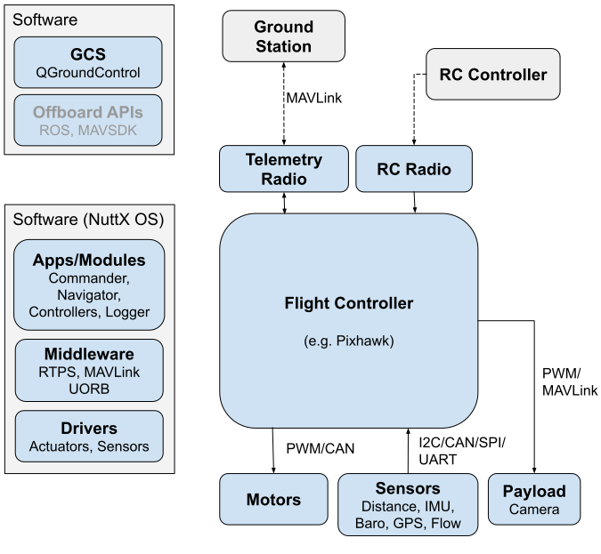
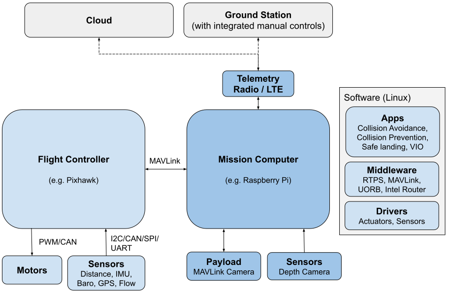

# PX4 System Architecture

The sections below provide high-level overview of the PX4 hardware and software stack for two "typical" PX4 systems; one that has just a flight controller, and another that has a flight controller and a mission computer (also known as a "companion computer"). 

:::note
The [PX4 Architectural Overview](../concept/architecture.md) provides information about the flight stack and middleware.
Offboard APIs are covered in [ROS](../ros/README.md) and [MAVSDK](https://mavsdk.mavlink.io/develop/en/index.html).
:::

## Flight Controller (only)

The diagram below provides a high level overview of a typical "simple" PX4 system based around a flight controller.

<!-- Source for drawing: https://docs.google.com/drawings/d/1_2n43WrbkWTs1kz0w0avVEeebJbfTj5SSqvCmvSOBdU/edit -->

The hardware consists of 
- [Flight controller](../flight_controller/README.md) (running the PX4 flight stack). This often includes internal IMUs, compass and barometer.
- [Motor ESCs](../peripherals/esc_motors.md) connected to [PWM outputs](../peripherals/pwm_escs_and_servo.md) or a [UAVCAN](../peripherals/uavcan_escs.md) bus (UAVCAN allows two-way communication, not single direction as shwown).
- Sensors ([GPS](../gps_compass/README.md), [compass](../gps_compass/README.md), distance sensors, barometers, optical flow, barometers, ADSB transponders, etc.) connected via I2C, SPI, UAVCAN, UART etc.
- Camera or other payload. Cameras can be connected to PWM outputs or via MAVLink.
- Telemetry radios for connecting to a ground station computer/software
- RC Control System for manual control 

The left hand side of the diagram shows the software stack, which is horizontally aligned (aproximately) with the hardware parts of the diagram.
- The ground station computer typically runs QGroundControl (or some other ground station software).
  It may also run robotics software like MAVSDK or ROS.
- The PX4 flight stack running on the flight controller includes drivers, comms and other middleware and numerous modules.

## FC and Mission Computer

The diagram below shows a PX4 system that includes both a flight controller and a mission computer.

<!-- source for drawing: https://docs.google.com/drawings/d/1zFtvA_B-BmfmxFmAd-XIvAZ-jRqOydj0aBtqSolBcqI/edit -->

The flight controller runs the normal PX4 flight stack, while a mission computer provides advanced features like object avoidance and collision prevention.
The two systems are connected using a fast serial or IP link, and typically communicate using the MAVLink protocol.
Communications with the ground stations and the cloud are usually routed via the mission computer (e.g. using the Intel Router).

PX4 systems typically run a Linux OS on the mission computer (because the PX4/Avoidance project delivers ROS-based avoidance libraries designed for Linux).
Linux is a much better platform for "general" software development than NuttX; there are many more Linux developers and a lot of useful software has already been written (e.g. for computer vision, communications, cloud integrations, hardware drivers).
Mission computers sometimes run Android for the same reason.

:::note
The diagram shows a cloud or ground station connection via LTE, an approach that has been used a number of PX4-based systems.
PX4 does not deliver software specifically for LTE and/or cloud integration (this requires custom development). 
:::

