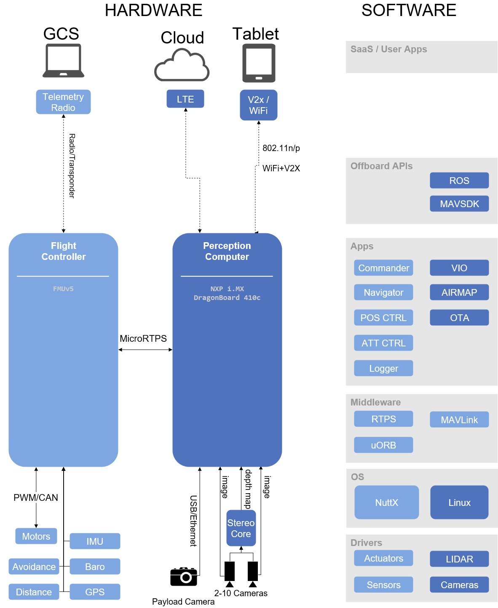

# PX4 Architecture

The diagram below provides a high level overview of a full PX4 onboard and offboard stack.
The left hand side shows one possible hardware configuration with a *flight controller* (light blue) connected to a *mission computer* (dark blue) via [MAVLink](../middleware/mavlink.md).
The mission computer provides vision control and object avoidance using ROS avoidance software (via a camera that can provide a 3D point cloud), and has a separate payload camera.

The right hand side of the diagram shows the end-to-end software stack.
The stack "approximately" aligns horizontally with the hardware parts of the diagram, and is colour-coded to show which software is running on the flight controller and which on the mission computer.

:::note
The [PX4 Architectural Overview](../concept/architecture.md) provides information about the flight stack and middleware.
Offboard APIs are covered in [ROS](../ros/README.md) and [MAVSDK](https://mavsdk.mavlink.io/develop/en/index.html).
:::

<!-- The drawing is on draw.io: https://drive.google.com/file/d/14sgSpcs7NcBatW-qn0dLtyMHvwNMSSlm/view?usp=sharing. Request access from dev team. -->
